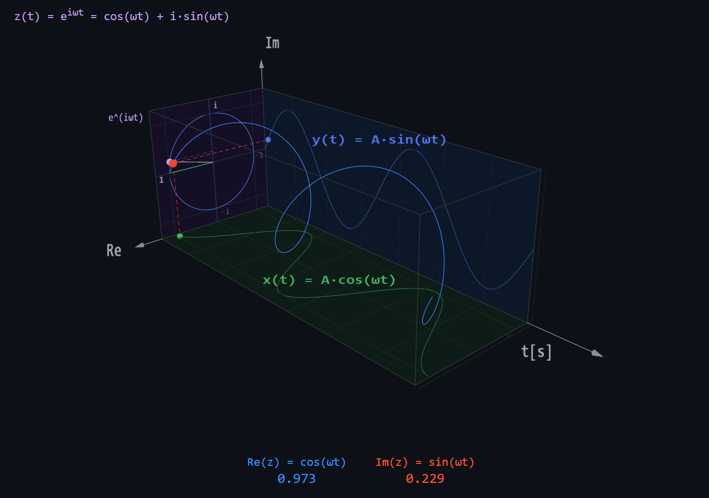

## Hi

Welcome buddy, here you will find some of what i've been studing for the past few years, like personal projects, notes from coursers and graduation classes.

  

---

---
> Math is the language of the universe. So the more equations you know, the more you can converse with the universe.

— Neil Degresse Tyson

<!---The background color is `#ffffff` for light mode and `#000000` for dark mode.
My [repositories](https://github.com/LucasEduardoSS?tab=repositories)
<!---
LucasEduardoSS/LucasEduardoSS is a ✨ special ✨ repository because its `README.md` (this file) appears on your GitHub profile.
You can click the Preview link to take a look at your changes.
--->
